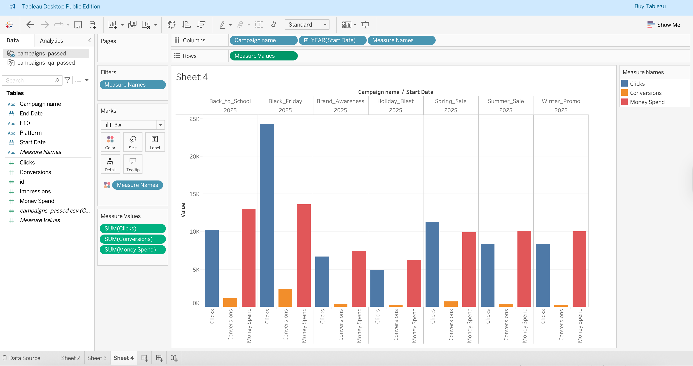

# PMX Data QA & Tableau Workflow

A personal project inspired by a QA Engineer role at Publicis Media Exchange (PMX).  
Goal: Recreate a realistic data QA workflow — from raw marketing data to clean, visualized insights in Tableau.

---

## 🔍 Overview
- Cleaned and validated marketing campaign data using SQL.  
- Built reusable QA scripts to detect missing or inconsistent metrics.  
- Created Tableau dashboards to visualize clean, verified data.  
- Focused on metrics such as CTR, CPC, Conversion Rate, and campaign performance by platform.

---

## ⚙️ Workflow
1. **Data Preparation**  
   - Used a synthetic dataset (`data/campaign_raw.csv`) with duplicates, missing values, and inconsistent formats.  
   - Fixed issues with SQL:  
     - Standardized date formats  
     - Corrected platform name variations  
     - Filled missing spend, clicks, conversions, and impressions  

2. **Data QA**  
   - Flagged inconsistent rows using conditional logic (`qa_flag` column).  
   - Created a filtered view `campaign_qa_passed` containing only verified data for analysis.  
   - Reusable SQL scripts:  
     - `01_check_missing_values.sql` – Identify nulls  
     - `02_fix_missing_values.sql` – Fill missing values  
     - `03_flag_suspicious_rows.sql` – Tag problematic rows  
     - `04_summary_report.sql` – Quick QA overview  
     - `05_create_qa_passed_view.sql` – Create `campaign_qa_passed` view

3. **Visualization**  
   - Connected Tableau to the QA-passed dataset.  
   - Built dashboards showing:  
     - Campaign spend, clicks, and conversions  
     - CTR and Conversion Rate trends over time  
     - Platform performance comparison  
     - QA data quality summary  

---

## 📊 Example Outputs


---

## 🧰 Tech Stack
- **SQL** (PostgreSQL or SQLite)  
- **Tableau** for visualization  
- **Git / GitHub** for version control  

---

## 📂 Folder Structure
```
etl-testing-workflow/
├─ data/
│  ├─ campaign_raw.csv
│  └─ campaign_qa_passed.csv
├─ sql/
│  ├─ 01_check_missing_values.sql
│  ├─ 02_fix_missing_values.sql
│  ├─ 03_flag_suspicious_rows.sql
│  ├─ 04_summary_report.sql
│  └─ 05_create_qa_passed_view.sql
├─ tableau/
│  └─ dashboard_screenshot.png
└─ readme.md
```

## 🧾 Next Steps
- Automate ETL + QA using dbt or Python scripts.  
- Expand dataset with multi-platform campaigns.  
- Add scheduled ETL checks (Airflow or similar).  
- Create Tableau dashboards with dynamic filters and KPIs.

---